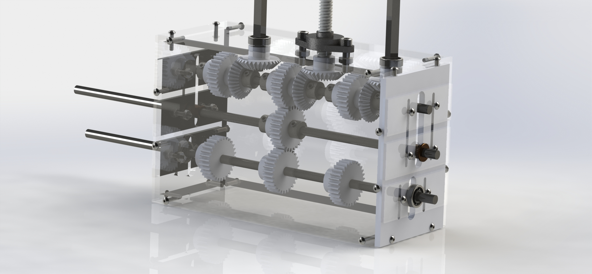

##[Grimdor: Underactuated Shoe Tying Robot Manipulator](https://www.youtube.com/watch?v=erNi07dH5pw)

## University of California, Davis, Senior Design Project 

Worked in a team of five undergraduates in the department of mechanical engineering to create a robot capable of tying a shoe with the following design restraints:
- Max of two actuators
- $600 budget

Robot won an annual UC Davis robotics competition and was featured on several [news sites](https://github.com/QuantuMope/grimdor-shoe-tying-robot/blob/master/shoe-tying-robot-press.txt) as well as broadcasted on networks such as CBS and NBC.  

Repository contains reports discussing design theory, CAD, circuit design, and controller code.  
